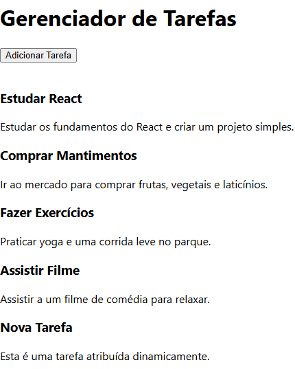
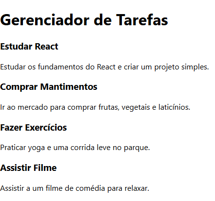

## Alterações Realizadas

1. **Uso de Estado no `TaskContainer`**:
   - Substituímos a lista estática de tarefas por um estado gerenciado com o hook `useState`.
   - Inicializamos o estado com a lista de tarefas existente.

2. **Função `addTask`**:
   - Criamos uma função que gera uma nova tarefa com um `id` único, um título fixo e uma descrição.
   - Atualizamos a lista de tarefas usando o método `setTasks`, adicionando a nova tarefa à lista existente.

3. **Adição de um Botão**:
   - Incluímos um botão acima da lista de tarefas.
   - O botão chama a função `addTask` ao ser clicado, adicionando uma nova tarefa à lista.

## Resultado
Ao clicar no botão "Adicionar Tarefa", uma nova tarefa é adicionada dinamicamente à lista e exibida no componente.

## Arquivos Modificados
### `TaskContainer.js`
- Implementação do estado com `useState`.
- Adição da função `addTask`.
- Inclusão de um botão para interação com a lista.



# **Task Manager - Documentação**

Este projeto é um gerenciador de tarefas simples construído com React. Ele exibe uma lista de tarefas com título e descrição e permite modularizar os componentes React para melhor organização.

## **Componentes Criados**
Abaixo está a descrição de cada componente criado no projeto:

---

### **1. Header**
**Descrição:** O componente `Header` é responsável por exibir o título principal do projeto.

**Código do componente:**
```jsx
import React from 'react';

function Header() {
  return (
    <header>
      <h1>Gerenciador de Tarefas</h1>
    </header>
  );
}

export default Header;
```

**Explicação do código:**
- O componente retorna um elemento `<header>` com um título `<h1>` que contém o nome do projeto.
- É um componente funcional simples que não possui estado ou propriedades.

---

### **2. Task**
**Descrição:** O componente `Task` é responsável por renderizar uma tarefa individual, exibindo o título e a descrição passados como `props`.

**Código do componente:**
```jsx
import React from 'react';
import PropTypes from 'prop-types';

function Task({ title, description }) {
  return (
    <div className="task">
      <h3>{title}</h3>
      <p>{description}</p>
    </div>
  );
}

Task.propTypes = {
  title: PropTypes.string.isRequired,
  description: PropTypes.string.isRequired,
};

export default Task;
```

**Explicação do código:**
- O componente usa **props** para receber o `title` (título da tarefa) e `description` (descrição da tarefa).
- A validação das `props` é feita usando o pacote `prop-types`, garantindo que `title` e `description` sejam do tipo string e obrigatórios.
- Retorna um bloco `<div>` que contém um `<h3>` para o título e um `<p>` para a descrição.

---

### **3. TaskContainer**
**Descrição:** O componente `TaskContainer` é responsável por renderizar uma lista de tarefas. Ele utiliza o componente `Task` para exibir cada tarefa individual.

**Código do componente:**
```jsx
import React from 'react';
import Task from './Task';

function TaskContainer() {
  const tasks = [
    { id: 1, title: 'Estudar React', description: 'Estudar os fundamentos do React e criar um projeto simples.' },
    { id: 2, title: 'Comprar Mantimentos', description: 'Ir ao mercado para comprar frutas, vegetais e laticínios.' },
    { id: 3, title: 'Fazer Exercícios', description: 'Praticar yoga e uma corrida leve no parque.' },
    { id: 4, title: 'Assistir Filme', description: 'Assistir a um filme de comédia para relaxar.' },
  ];

  return (
    <div>
      {tasks.map((task) => (
        <Task key={task.id} title={task.title} description={task.description} />
      ))}
    </div>
  );
}

export default TaskContainer;
```

**Explicação do código:**
- Define um array `tasks` com 4 tarefas, onde cada tarefa possui `id`, `title` e `description`.
- Usa o método `.map()` para iterar sobre o array `tasks` e renderizar um componente `Task` para cada item.
- Passa `title` e `description` como `props` para o componente `Task`.
- A `key` única para cada tarefa é o `id`, para garantir que o React gerencie a lista corretamente.

---

### **4. App**
**Descrição:** O componente `App` é o componente principal do projeto. Ele organiza e integra os componentes `Header` e `TaskContainer`.

**Código do componente:**
```jsx
import React from 'react';
import Header from './components/Header';
import TaskContainer from './components/TaskContainer';

function App() {
  return (
    <div className="App">
      <Header />
      <TaskContainer />
    </div>
  );
}

export default App;
```

**Explicação do código:**
- Importa os componentes `Header` e `TaskContainer`.
- Renderiza os dois componentes em uma estrutura simples dentro de uma `<div>` com a classe `"App"`.
- Serve como ponto de entrada do aplicativo.
